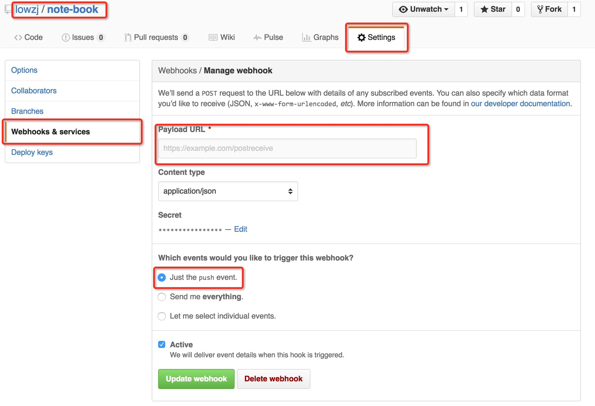

# [@lowzj](https://github.com/lowzj/note-book)

[](https://github.com/lowzj)

### Introduction

本站是[@lowzj](https://github.com/lowzj)的个人学习笔记，编写markdown文件后push到GitHub上即可同步更新网站内容。
使用下面几个组件搭建：

* `markdown`。所有内容均使用`markdown`编写。
* `git`。版本控制。
* [gitbook](https://github.com/GitbookIO/gitbook)。将markdown生成网页文件。
* `GitHub`。代码托管。
* 部署发布，2种方式:
    1. `GitHub Pages & Actions`(推荐)
    2. 自建: `nginx`, `github webhooks`(发送repo事件通知), `python webpy`(简单的web server,接收处理`GitHub`事件。

下面简单介绍下如何自建一个gitbook网站。

### 如何生成一个`GitBook`

* 安装`gitbook`。[参考: CentOS上安装gitbook](http://www.jianshu.com/p/4ddfe52a27e4)
    ```sh
    # centos
    yum -y install nodejs npm git
    npm install -g gitbook-cli
    # macOS
    brew install node npm
    npm install -g n gitbook-cli
    ```

* demo
    ```sh
    $ mkdir demo
    $ cd demo
    $ gitbook init
    $ gitbook serve .
    Starting server ...
    Serving book on http://localhost:4000
    ```

### 利用GitHub部署及自动更新

#### Step 1: GitHub上创建repo, 存放gitbook的markdown文件。

#### Step 2: 自动构建部署

##### 自动构建部署-方案1：GitHub Pages & Actions`

* 在新建的GitHub Repo上新增一个workflow文件(`./github/workflows/gh-pages.yml`)用于构建部署github
  pages，参考本站的自动构建脚本: [.github/workflows/gh-pages.yml](https://github.com/lowzj/note-book/blob/main/.github/workflows/gh-pages.yml)。
  > [Quickstart for GitHub Actions](https://docs.github.com/en/actions/quickstart)
* 配置GitHub Pages通过GitHub
  Action进行构建，参考: [Publishing with a custom GitHub Actions workflow](https://docs.github.com/en/pages/getting-started-with-github-pages/configuring-a-publishing-source-for-your-github-pages-site#publishing-with-a-custom-github-actions-workflow)

#### 自动构建部署-方案2: 自建服务器，通过webhooks构建部署

* 部署到服务器
    * 首先得有一个能让外网机器访问的服务器
    * 然后在该服务器上将git repo clone下来，执行`gitbook serve .`，就可以生成一个gitbook网站啦

        ```
        mkdir -p ~/gitbook/
        cd ~/gitbook
        git clone git@github.com:lowzj/note-book.git
        cd note-book
        nohub gitbook serve . > /tmp/note-book.log 2>&1 &
        ```

        > **NOTE**: 可能会报错，解决方案参考: [cb.apply is not a function](https://github.com/GitbookIO/gitbook-cli/issues/110#issuecomment-863706455)
    * 当然可以使用nginx等反向代理，访问`gitbook build`生成的`_book`静态文件，这里就不多说了
* **自动更新**。当commit push到github后，就更新服务器上的本地repo，如果使用`gitbook build`，就再重新build一次。
    * 这里要利用github提供的[Webhooks](https://developer.github.com/webhooks/)功能。到github repo的`Settings`
      页面，选择`Webhooks & services`，如图所示。
      
      > Webhooks allow external services to be notified when certain events happen within your repository. When the
      specified events happen, we’ll send a POST request to each of the URLs you provide. Learn more in
      our [Webhooks Guide](https://developer.github.com/webhooks).

    * 其中最重要的一项配置就是`Payload URL`，对应着自己服务器上web server提供的`POST`
      接口。这里使用webpy给出一个简单的例子`main.py`。

        ```python
        #!/usr/bin/env python
        # -*- coding:utf-8 -*-
        import web
        import commands 

        urls = (
            '/', 'Index'
        )

        class Index:
          def GET(self):
            return "Hello World"
        
          def POST(self):
            note_book_home="/home/zj/github/note-book"
            out = commands.getoutput("cd " + note_book_home + " && git pull")
            return out
        
        app = web.application(urls, globals())
        if __name__ == "__main__":
          app.run()
        ```

      运行`python main.py 9999`，端口是`9999`，在`Payload URL`中填入`http://your_ip:9999`。
    * 好了，以上就基本完成了自建`gitbook`的部署以及自动更新。

### 问题

mac上安装过程中可能遇到的问题

* 需要先下载安装xcode
* [xcode-select active developer directory error](https://stackoverflow.com/questions/17980759/xcode-select-active-developer-directory-error/17980786#17980786)
* [**cb.apply is not a function**](https://flaviocopes.com/cb-apply-not-a-function/)
* [GitHub Issue: **cb.apply is not a function**](https://github.com/GitbookIO/gitbook-cli/issues/110)

---

<pre align='center'>
Expect The Unexpected!
</pre>
