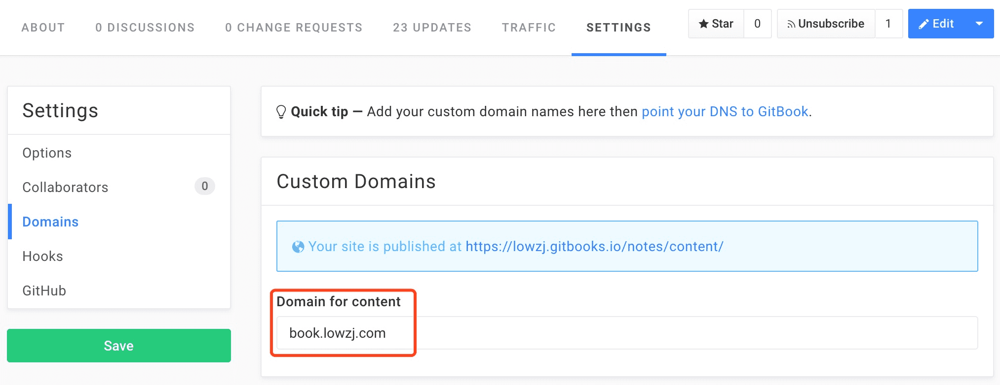

# GitBook自定义域名

官方文档：https://help.gitbook.com/books/can-i-use-custom-domain.html

* 首先得有一个自己的域名，国内如万网，DNSPod，国外GoDaddy，CheapName都可以申请。国内需要备案，国外申请完稍等十来分钟就可以用了，省时间省精力。我是在GoDaddy(支持支付宝)上申请完域名，然后设置域名服务器为国内的DNSPod。
* 一般域名供应商都会提供DNS解析，添加一条`CNAME`记录，将`URL`项填为：`www.gitbooks.io`。例如申请的域名为`lowzj.com`，添加一条`book`的`CNAME`记录：

* 然后到自己的gitbook设置页：`Settings` -> `Domains` -> `Domain for content`，填上自己刚才地址，点击`Save`，进行检查，会提示域名是否设置正确，同时会将该地址与当前gitbook进行关联。

* 以上就算大功告成了，可以访问`book.lowzj.com`就可以看到自己的GitBook了。当然域名变更会有延迟，请耐心等待。
