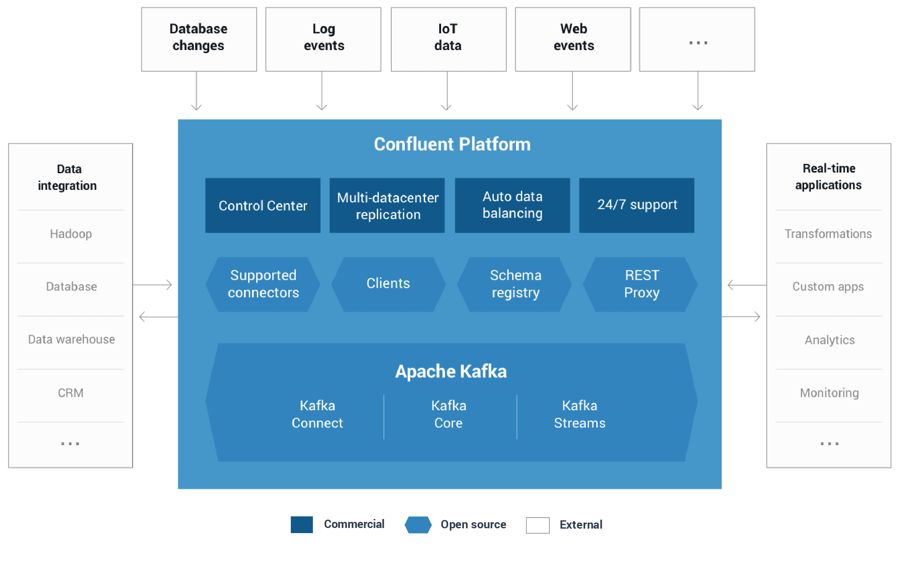

[Confluent Platform](http://docs.confluent.io/3.2.0/platform.html)
==================

<pre align='center'>
可以使我们在一个稳定高效的系统中组织和管理不同源数据的流处理平台。
</pre>

## Introduction
> Confluent Platform可以轻松构建实时数据管道和流应用程序。 通过将来自多个来源和位置的数据集成到您公司的单一中央流处理平台中，Confluent Platform可让您专注于如何从数据中获取商业价值，而不必担心数据如何在各种系统之间传输或通知的基本机制。 具体来说，Confluent Platform简化了将数据源连接到Kafka，使用Kafka构建应用程序，同时也保护，监控和管理您的Kafka基础设施。



社区版包括四个组件
* [Schema Registry](#schema-registry)
* [REST Proxy](#rest-proxy)
* [Kafka Connectors](#kafka-connectors)
* [Kafka Clients](#kafka-clients)

## Installation

先去官网下载: [https://www.confluent.io/download/](https://www.confluent.io/download/), 解压之后并启动
```sh
mkdir /tmp/confluent
tar -zxf confluent-oss-3.2.0-2.11.tar.gz
ln -s confluent-3.2.0 confluent
CONFLUENT_DIR=./confluent
echo 'start confluent zookeeper...'
nohup $CONFLUENT_DIR/bin/zookeeper-server-start $CONFLUENT_DIR/etc/kafka/zookeeper.properties > /tmp/confluent/zookeeper.log 2>&1 &
sleep 2
echo 'start confluent kafka...'
nohup $CONFLUENT_DIR/bin/kafka-server-start $CONFLUENT_DIR/etc/kafka/server.properties > /tmp/confluent/kafka.log 2>&1 &
sleep 2
echo 'start confluent rest-proxy...'
nohup $CONFLUENT_DIR/bin/kafka-rest-start $CONFLUENT_DIR/etc/kafka-rest/kafka-rest.properties > /tmp/confluent/kafka-rest.log 2>&1 &
sleep 2
echo 'start confluent schema-registry...'
nohup $CONFLUENT_DIR/bin/schema-registry-start $CONFLUENT_DIR/etc/schema-registry/schema-registry.properties > /tmp/confluent/schema-registry.log 2>&1 &
```

## Schema Registry

> **松耦合系统最困难的挑战之一是确保数据和代码随着系统的增长和演进而兼容。**使用诸如Kafka的消息服务，彼此交互的服务必须对消息的通用格式（称为schema）达成一致。在许多系统中，这些格式是临时的，仅由代码隐式定义，并且通常在使用该消息类型的每个系统上重复定义。

> 随着需求的改变，有必要演进这些格式。只有一个临时的定义，开发人员很难确定他们的变化所造成的可能的影响是什么。

> **Confluent Schema Registry通过集中管理以[Avro](http://avro.apache.org/)序列化系统编写的schema，实现了schema的安全，零停机演进。**它跟踪Kafka中每个topic的所有schema版本，并且只允许遵循用户定义的兼容性设置的schema变化。这使开发人员有信心他们可以根据需求安全地修改schema，而不必担心会中断他们不知道的服务。

> Schema Registry还包括Kafka客户端的插件，用于存储和获取以Avro格式发送的Kafka消息的schema。这种集成是无缝的 - 如果已经使用Kafka与Avro数据，则使用Schema Registry，只需要让应用包含一个序列化器并更改一个设置。

## REST Proxy

> Apache Kafka和Confluent为Java，C，C ++和Python提供本地客户端，使其能够通过Kafka快速，轻松地生成和使用消息。这些客户端通常以最简单，最快速，最安全的方式与kafka直接通信。

> 但有时，编写和维护使用本机客户端的应用程序是不实际的。例如，团队可能想要将使用PHP编写的旧应用程序连接到Kafka。Confluent Platform包括一个REST Proxy，解决了这些问题。

> Confluent Kafka REST Proxy通过提供用于与Kafka集群交互的RESTful HTTP服务，任何语言都可以轻松地与Kafka一起工作。 REST Proxy支持所有核心功能：向Kafka发送消息，读取消息(单独或者作为consumer group的一部分)，以及检查集群元数据，例如topic列表及其设置。

> REST Proxy还与Schema Registry集成。它可以在Schema Registry中读取和写入Avro数据，注册和查找schema。由于它会自动将JSON数据转译为Avro或从Avro转译，所以**任何语言仅使用HTTP和JSON就可获得集中式管理schema的所有优点**。

## Kafka Connectors

> 利用Kafka Connect API，**Kafka Connectors将Kafka连接到其他数据系统**，如Apache Hadoop。我们已经为最流行的数据源(source)和接收器(sink)构建了连接器，包括这些基于Confluent Platform的全部测试过的和已支持的connector版本。

> Kafka Connect是一个框架，用于将Kafka与外部系统（如数据库，键值存储，搜索索引和文件系统）可扩展地，可靠地连接起来。

## Kafka Clients

支持Java，C/C++，Python，Go。

