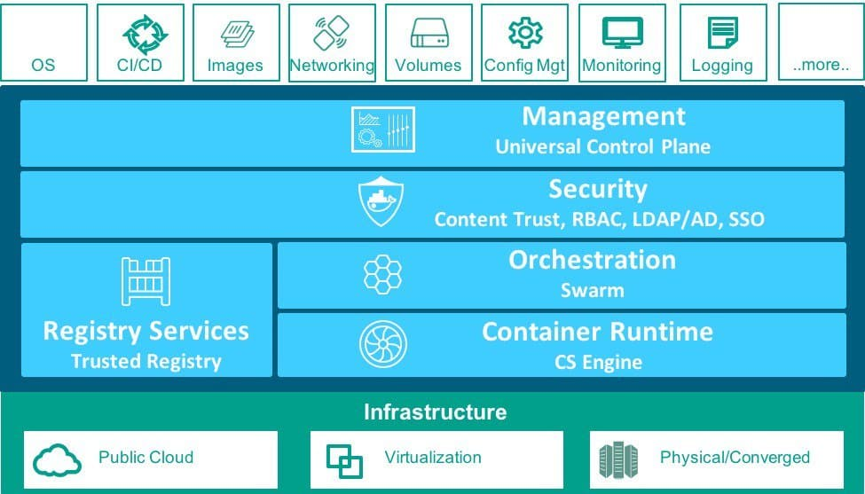

# Microservice

> Sam Newman: Microservices are not something you should aim for. They are a means to an end. Focus on what's important - building useful software.

## Microservice-Ecosystem

## Docker

## Readings

* [Scalable Microservices through Messaging](http://developers.redhat.com/blog/2016/05/26/scalable-microservices-through-messaging/)
