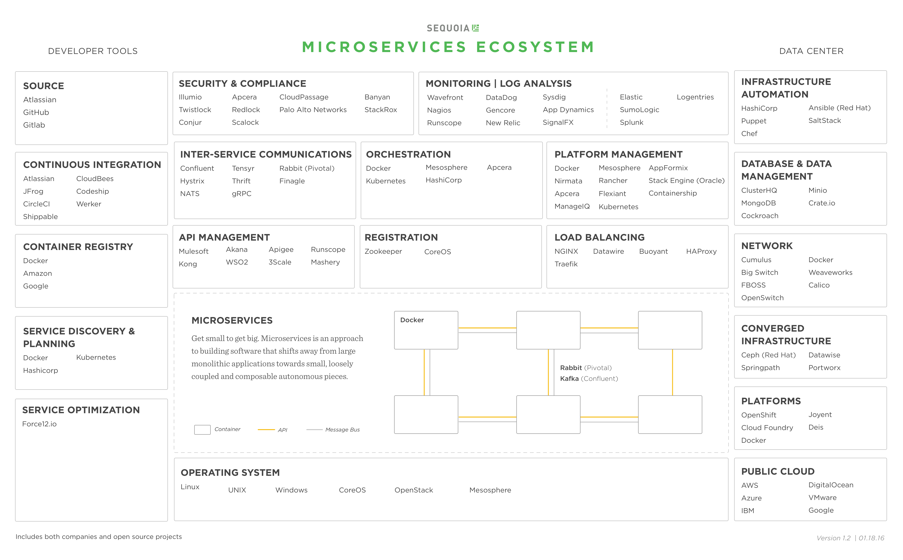
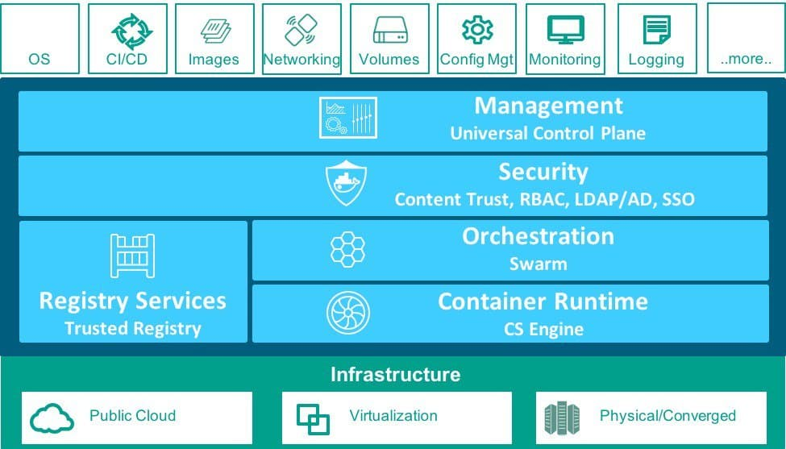

# Microservice

> Sam Newman: Microservices are not something you should aim for. They are a means to an end. Focus on what's important - building useful software.

## Microservice-Ecosystem

source: [Get Small To Get Big Through Microservices](https://techcrunch.com/2016/01/23/get-small-to-get-big-through-microservices)

## Docker

## Deployment Strategy

* Multiple Service Instances per Host Pattern
* Multiple Service Instances

## The Scale Cube

* X-axis. horizontal duplication, scale by cloning.
* Y-axis. functional decomposition, scale by splitting different this.
* Z-axis. data partitioning, scale by splitting similar things.

## Readings

* [Microservice architecture patterns and best practices](http://microservices.io/index.html)
  * [The Scale Cube](http://microservices.io/articles/scalecube.html)
* Tecknology Stack
  * [Anatomy of a Modern Production Stack](https://www.eightypercent.net/post/layers-in-the-stack.html)
* Service Discovery
  * [SmartStack](http://nerds.airbnb.com/smartstack-service-discovery-cloud)
  * [Docker networking and service discovery](https://www.oreilly.com/learning/docker-networking-service-discovery)
  * [Service Discovery in a Microservices Architecture](https://www.nginx.com/blog/service-discovery-in-a-microservices-architecture/)
  * [Consul Service Discovery And Health](http://www.mammatustech.com/consul-service-discovery-and-health-for-microservices-architecture-tutorial)
  * [Zookeeper vs Etcd vs Consul](https://technologyconversations.com/2015/09/08/service-discovery-zookeeper-vs-etcd-vs-consul)
* Orchestration
  * [DC/OS Architecture](https://dcos.io/docs/1.7/overview/architecture/)
  * [A Brief Comparison of Mesos and Kubernetes](http://thenewstack.io/a-brief-comparison-of-mesos-and-kubernetes)
  * [Marathon](https://mesosphere.github.io/marathon/)
  * [Borg-Omega-Kubernetes](http://www.dockone.io/article/1153)
* Architecture
  * [Scalable Microservices through Messaging](http://developers.redhat.com/blog/2016/05/26/scalable-microservices-through-messaging/)
* Scheduler
  * [Fenzo: OSS Scheduler for Apache Mesos Frameworks](http://techblog.netflix.com/2015/08/fenzo-oss-scheduler-for-apache-mesos.html)
  * [Improving Netflix’s Operational Visibility with Real-Time Insight Tools](http://techblog.netflix.com/2014/01/improving-netflixs-operational.html)
  * [Scryer: Netflix’s Predictive Auto Scaling Engine](http://techblog.netflix.com/2013/11/scryer-netflixs-predictive-auto-scaling.html)
  * [Scryer: Netflix's Predictive Auto Scaling Engine - Part 2](http://techblog.netflix.com/2013/12/scryer-netflixs-predictive-auto-scaling.html)
* Inter-Services Communication
  * [Hystrix](http://my.oschina.net/ybakswu/blog/734374)
* Serverless
  * [The Future of Serverless Compute](https://www.infoq.com/articles/future-serverless)
* Others
  * [Mesos Documents](http://mesos.apache.org/documentation/latest/)
  * [Marathon Documents](https://mesosphere.github.io/marathon/docs/)
  * [Mesospher Downloads](https://mesosphere.com/downloads/)
  * [Introducing the Microservices Reference Architecture from NGINX](https://www.nginx.com/blog/introducing-the-nginx-microservices-reference-architecture/)
