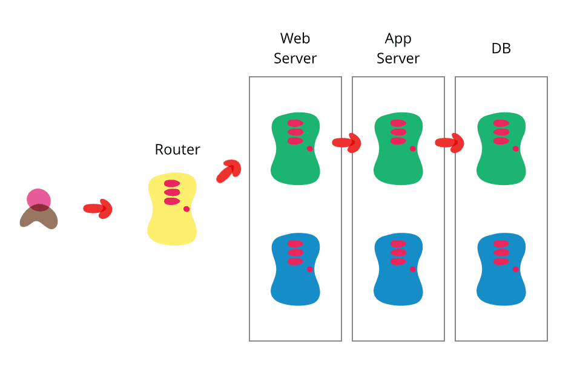
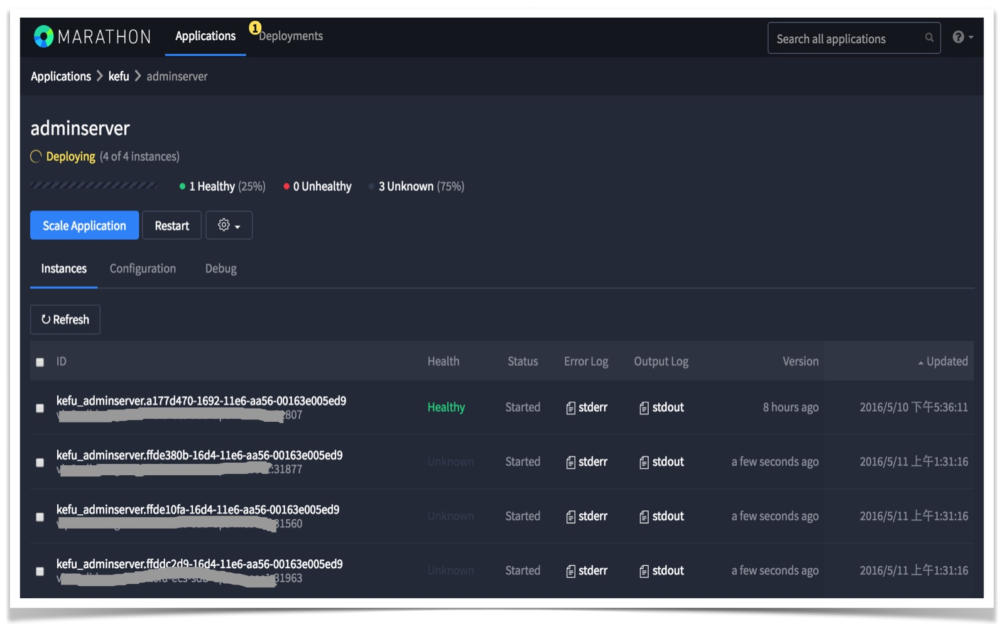

# Blue Green Deployment

> Blue-Green Deployment 示意图如下，摘自[链接](http://martinfowler.com/bliki/BlueGreenDeployment.html)


----

### 灰度方案

> `目标`
> * 自动部署
> * 平稳升级
> * 快速回滚

#### A/B Cluster

两套完全相同的集群，相同是指基础架构完全一致，功能可以不一致。

#### 集群状态

* `R`: RED. 集群不再对外服务，流量已经完全切走，可以随时停止。
* `Y`: YELLOW. 集群处于灰度状态中，待发布。
* `G`: GREEN. 当前正在提供正常服务。

#### 灰度策略

* 白名单

    ```sh
    "route-strategy":
      A: 
        status: Y
        id: 
          all: false # 为true时，所有id。为false，则看`ids`, `interval`配置
          ids: [1, 2, 3]
          interval:[[1,100], [600,10000]]
      B:
        status: G
        id:
          all: true
    ```
* router / load balancer
    * 定期获取白名单，比如定期1秒等，为了方便称之为`router.interval`。
    * 根据请求，判定走哪一个cluster。
    * 从服务注册中心获取所有服务信息，更新cluster upstream。
    * 路由优先级: `Y > G`。`R`状态下，不会有任何流量。同状态下随机路由。
    
    > 以上可以支持多版本灰度，比如增加`C`，设置`C.status:Y`，再设置灰度策略。


#### 升级流程 - 灰度

* 首先确定当前集群状态。假设现在正在运行的集群为`A`，其状态为`G`；则集群`B`状态为`R`。`B`为待发布版本。
* 启动`B`中待升级的服务，规模与`A`相同。
* 设置`B.id.all:false`，其他清空`B.id.ids, B.id.internal`，确保流量不会到`B`。
* 修改`B.status`为`Y`，作为灰度版本。
* 修改灰度白名单`B.id.ids, B.id.internal`，部分导流到`B`。进行线上回归测试。
* 测试完成，进行全量升级。
    * 将`B.id.all`改为`true`，等待一段时间`router.interval`。
    * 测试...并观察`A`流量是否完全切走。
* A/B状态切换，注意顺序
    * 测试完成后，将`A.status`改为`R`。停止`A`对外提供服务。
    * 将`B.status`改为`G`，升级完成，正式提供服务。
    * 将`A`停止，但不要销毁，即`A`启动所需的所有配置和脚本都不要删除修改，用于回滚。

#### 升级流程 - 集群切换

* 一样的地方
    * 首先确定当前集群状态。假设现在正在运行的集群为`A`，其状态为`G`；则集群`B`状态为`R`。`B`为待发布版本。
    * 启动`B`中待升级的服务，规模与`A`相同。
    * 设置`B.id.all:false`，其他清空`B.id.ids, B.id.internal`，确保流量不会到`B`。
    * 修改`B.status`为`Y`，作为灰度版本。
* 不一样
    * A/B状态切换。直接进行，不再经过灰度阶段。
        * 测试完成后，将`A.status`改为`R`。停止`A`对外提供服务。
        * 将`B.status`改为`G`，升级完成，正式提供服务。
        * 将`A`停止，但不要销毁，即`A`启动所需的所有配置和脚本都不要删除修改，用于回滚。


#### 升级流程 - 逐个更新

* 一样的地方
    * 首先确定当前集群状态。假设现在正在运行的集群为`A`，其状态为`G`；则集群`B`状态为`R`。`B`为待发布版本。
* 不一样
    * 设置`B.status:G`, `B.id.all:true`
    * 启动`B`中待升级的服务，实例数为1。
    * 停掉`A`中的一个实例。
    * 重复执行以上2步，`B`中实例数逐个增加到`A`中原先实例数，`A`中实例数最终变为0。
    * 设置`A.status:R`，停止`A`。

#### 回滚流程

回滚操作等同于一次升级，经过上面的`升级流程`后，`B`变为了线上运行的版本，状态为`G`，需要回滚到`A`，此时状态为`R`。

* 启动`A`中服务，检查所有健康检测。
* 待健康检测成功后，设置`A.id.all:true`，再设置`A.status`改为`Y`。
* 检查确认流量全部进入`A`，同时`B`无流量。
* A/B状态切换
    * 设置`B.status:R`，停止`B`对外提供服务。
    * 设置`A.status:G`，回滚完成，正式提供服务。
    * 将`B`停止。

----

### TODO

#### 灰度管理平台

* 集群状态管理(增删改查)
* 灰度策略修改
* 升级任务及操作记录

#### 服务注册中心

* consul
* 服务支持注册/发现

#### Router/LB(nginx)

* 支持从注册中心拉取服务列表(nginx-upsync, consul-template)
* 灰度策略及路由策略实现
* 配置管理及版本控制
* 配置更新机制: 手动 -> 自动

#### 部署工具

* 程序包管理
    * java: nexus
    * docker: docker-registry
* mesos
    * 分布式系统内核
    * HA: zookeeper
    * 资源管理: mesos-master, mesos-slave。每台宿主机需要部署一个mesos-slave。
    * 进程级监控，自动拉起
    * 实时log
* marathon. 自动部署。
    * auto-deployment
    * auto-scaling
    * 健康检测
    * management api，实现自动化的必要条件
* 脚本版本控制。

#### 配置中心

* 变更可追踪
* 静态配置: ConfigServer
    * 整理分类
* 运行时配置

#### 监控

* 机器级别
    * cpu/ram/disk
    * process/fd/load/io/network
* 服务级别
    * health: AdminServer, nginx, consul
    * metrics
    * config

#### 日志

* 服务日志规范化
    * 每个请求必须输出一条日志，包括请求参数(如organId/tenantId/userId，以及其他此请求必须具备的参数)，处理结果成功与否，总的相应时间以及重要步骤的处理时间。
* 日志收集及统一

----

> **Marathon Auto-Scaling**, add 3 instances
> 

----


### Readings

* [BlueGreenDeployment](http://martinfowler.com/bliki/BlueGreenDeployment.html)
* [The DOs and DON'Ts of Blue/Green Deployment](https://cloudnative.io/blog/2015/02/the-dos-and-donts-of-bluegreen-deployment/)
* [How To Use Blue-Green Deployments to Release Software Safely](https://www.digitalocean.com/community/tutorials/how-to-use-blue-green-deployments-to-release-software-safely)
* [Marathon Blue-Green Deployment](https://mesosphere.github.io/marathon/docs/blue-green-deploy.html)
