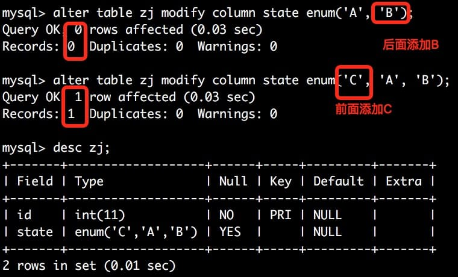

# mysql

### 修改表结构，而不锁表的情况

对于`alter table`，如果是在`enum`中添加新值的话，在后面添加，不会发生`copy table`，速度会非常快。

For ALTER TABLE tbl_name RENAME TO new_tbl_name without any other options, MySQL simply renames any files that correspond to the table tbl_name without making a copy. (You can also use the RENAME TABLEstatement to rename tables. See Section 13.1.33, “RENAME TABLE Syntax”.) Any privileges granted specifically for the renamed table are not migrated to the new name. They must be changed manually.

Alterations that modify only table metadata and not table data can be made immediately by altering the table's.frm file and not touching table contents. The following changes are fast alterations that can be made this way:

Renaming a column, except for the InnoDB storage engine.

Changing the default value of a column (except for NDB tables; see Limitations of NDBCLUSTER online operations).

Changing the definition of an ENUM or SET column by adding new enumeration or set members to the end of the list of valid member values, as long as the storage side of the data type does not change. For example, adding a member to a SET column that has 8 members changes the required storage per value from 1 byte to 2 bytes; this will require a table copy. Adding members in the middle of the list causes renumbering of existing members, which requires a table copy.

ALTER TABLE ... ADD PARTITION creates no temporary table except when used with NDB tables. ADD or DROPoperations for RANGE or LIST partitions are immediate operations or nearly so. ADD or COALESCE operations forHASH or KEY partitions copy data between changed partitions; unless LINEAR HASH or LINEAR KEY was used, this is much the same as creating a new table (although the operation is done partition by partition). REORGANIZEoperations copy only changed partitions and do not touch unchanged ones.

Renaming an index, except for InnoDB.

Adding or dropping an index, for InnoDB (if InnoDB Plugin is used) and NDB.

### 外键

* MySQL 要求被引用列必须有索引。
* 不要求被引用列是`UNIQUE`或者`NOT NULL`，但是这些外键定义是不好的，并且在做级联更新和删除的时候有问题。
* 强烈建议只引用`UNIQUE`(包括`PRIMARY`)并且是`NOT NULL`的列作为外键。

> Additionally, MySQL requires that the referenced columns be indexed for performance reasons. However, the system does not enforce a requirement that the referenced columns be UNIQUE or be declared NOT NULL. The handling of foreign key references to nonunique keys or keys that contain NULL values is not well defined for operations such as UPDATE or DELETE CASCADE. You are advised to use foreign keys that reference only UNIQUE (including PRIMARY) and NOT NULL keys.
