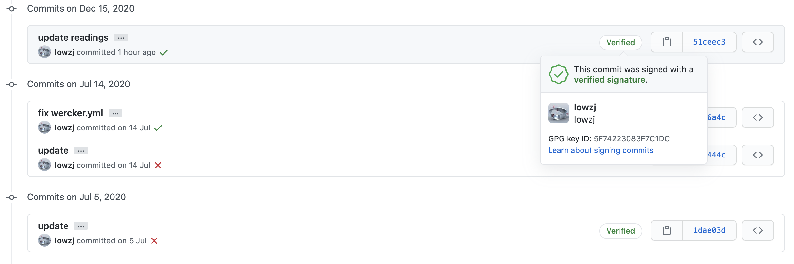

# 使用GPG给commits签名

## 效果
不说话，先上效果图



签名后在commit后有个Verified标志，点击可以展开签名信息。

## 操作
**具体操作如下**：
1. [Generating a new GPG key](https://docs.github.com/en/free-pro-team@latest/github/authenticating-to-github/generating-a-new-gpg-key)
2. [Adding a new GPG key to your GitHub account](https://docs.github.com/en/free-pro-team@latest/github/authenticating-to-github/adding-a-new-gpg-key-to-your-github-account)
3. [Telling Git about your signing key](https://docs.github.com/en/free-pro-team@latest/github/authenticating-to-github/telling-git-about-your-signing-key)
4. [Signing commits](https://docs.github.com/en/free-pro-team@latest/github/authenticating-to-github/signing-commits)

> 一定按顺序执行

### 生成 GPG key
- 安装 gpg
- 生成 GPG key，
  - 可以一直Enter默认，按提示操作
  - 最后会出现一个终端对话框，可能中文乱码，要求输入密码以及确定。密码一定要保存好。
- 列出已生成的 GPG key
- 将刚刚生成的 GPG key 的公钥拷贝到系统粘贴板，这个公钥需要填到 GitLab 或 GitHub 上。

```bash
#!/bin/bash

which gpg || brew install gpg

# generate
gpg --full-generate-key

# list
email=`gpg --list-secret-keys --keyid-format LONG | grep '^uid' | awk -F'\<|\>' '{print $(NF-1)}' | tail -n1`
echo "$email"
sec=`gpg --list-secret-keys --keyid-format LONG $email | grep '^sec' | awk -F'/' '{print $2}' | awk '{print $1}'`
echo "$sec"

gpg --armor --export $sec | pbcopy
```

### 添加到GitLab或GitHub
将上面拷贝好的公钥上传到GitHub服务器, 参考操作2文档。

### 配置本地Git，添加signing key
参考操作3, 生成gpg key后，需要通知git要用生成的key进行签名：
- 拿到key
- 配置git

```bash
secKey=`gpg --list-secret-keys --keyid-format LONG ${UNAME} | grep '^sec' | awk -F'/' '{print $2}' | awk '{print $1}'`
git config --global user.signingkey $secKey
```

如果有多个GPG key，可以在每个repo下面做局部设置

```bash
git config --local user.signingkey $secKey
```

其中 `UNAME` 就是生成 GPG key 时填的用户名，也可以使用email。

### 给commit签名
参考操作4，需要输入密码

```bash
git commit -S -m 'commit message'
```

可以设置git全局配置，默认给commit都加签名，不用每次都加 -S 选项。

```bash
git config -global commit.gpgsign true
```

### 验证commit签名

```bash
$ git verify-commit HEAD
gpg: Signature made 二 12/15 22:52:03 2020 CST
gpg:                using RSA key <your_key>
gpg: Good signature from "lowzj <zj3142063@gmail.com>" [ultimate]
```

另外可以增加参数 -s 直接在commit message中显示添加commiter信息，即下面的 Signed-off-by。此步骤跟上面无关：https://segmentfault.com/q/1010000004044749

```
* commit 51ceec39cd48d368306730a5cf1b6745cc3c8fa2 (HEAD -> master, origin/master, origin/HEAD)
| Author: lowzj <zj3142063@gmail.com>
| Date:   Tue Dec 15 22:52:03 2020 +0800
|
|     update readings
|
|     Signed-off-by: lowzj <zj3142063@gmail.com>
```

## 参考文档
- https://www.ruanyifeng.com/blog/2013/07/gpg.html
- https://stackoverflow.com/questions/39494631/gpg-failed-to-sign-the-data-fatal-failed-to-write-commit-object-git-2-10-0
- signoff: https://segmentfault.com/q/1010000004044749

## FAQ
> 终端乱码如何解决？

将使用语言改为英文，添加到`~/.bashrc` 或 `~/.bash_profile` 或 `~/.zshrc`
```
export LANGUAGE=en
```

> error: gpg failed to sign the data
> fatal: failed to write commit object

```bash
export GPG_TTY=$(tty)
```
