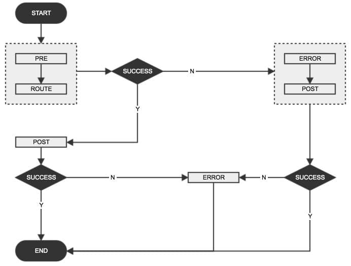

# SpringCloud-Zuul 异常处理

_2017-05-10_

最近看到了一个[GitHub issue](https://github.com/spring-cloud/spring-cloud-netflix/issues/1874)在讨论如何在`post`类型的zuul filter中设置response body，实际上提问者是想在异常情况下，如何返回一个自定义的response body。正好我在升级spring-cloud，也想弄清楚，spring-cloud-zuul是如何处理异常情况的，所以就仔细看了看这部分的实现细节，现在做个笔记记录下来。

关于zuul是如何工作的，这里不再介绍，具体可以参看[这里](https://github.com/Netflix/zuul/wiki/How-it-Works)。官方给了一个zull请求的生命周期图：


上图中，实线表示请求必然经过的路径，而虚线表示可能经过的路径；从这张图中可以看出：
* 所有请求都必然按照`pre`-> `route` -> `post`的顺序执行。
* `post`返回response。
* 如果`pre`中有自定义filter，则执行自定义filter。
* 如果`pre`,`route`,`post`发生错误则执行`error`，然后再执行`post`。

这张图忽略了很多细节；最明显的就是，自定义的filter可以是`pre`,`route`,`post`,`error`中的任何一种；其次假如`post`中发生了异常，执行流程交给`error`处理完之后，又重新回到`post`中，会不会又有问题？

所以还是看看代码比较靠谱。以下基于spring-cloud Dalston.RELEASE做代码分析。

调试一下，就可以看到请求进入zuul之后的整个调用链，简单来说如下：`ZuulServlet#service` -> `FilterProcessor#processZuulFilter` -> `ZuulFilter#runFilter` -> `[Concret]ZuulFilter#run`。

### ZuulServlet#service

首先找到请求进入zuul filters的入口：[ZuulServlet#service(ServletRequest, ServletResponse)](https://github.com/Netflix/zuul/blob/1.x/zuul-core/src/main/java/com/netflix/zuul/http/ZuulServlet.java#L64)。

下面抽出这个函数的主干：

```java
 65         try {
            ...
 73             try {
 74                 preRoute();
 75             } catch (ZuulException e) {
 76                 error(e);
 77                 postRoute();
 78                 return;
 79             }
 80             try {
 81                 route();
 82             } catch (ZuulException e) {
 83                 error(e);
 84                 postRoute();
 85                 return;
 86             }
 87             try {
 88                 postRoute();
 89             } catch (ZuulException e) {
 90                 error(e);
 91                 return;
 92             }
 93
 94         } catch (Throwable e) {
 95             error(new ZuulException(e, 500, "UNHANDLED_EXCEPTION_" + e.getClass().getName()));
 96         }
```

这个函数基本遵从但不完全符合官网给出的生命周期图：

* 正常情况下，请求只经过`pre` -> `route` -> `post`。
* 两层`try...catch`，内层只捕获`ZuulException`，而其他异常由外层捕获。
* 内层3个`try...catch`语句，只有`pre`,`route`抛出`ZuulException`时，才会执行`errror`，再执行`post`。而当`post`(88行)抛出`ZuulException`后，只会执行`error`。
* 外层捕获其他异常(内层`try`语句块中抛出的非`ZuulException`异常以及内层`catch`语句中抛出的所有异常)后，将HTTP状态码设置为500，同时交给`error`处理。
* 整个流程的终点有两个：`post`及`error`；而非只有`post`一个。

另外看一下`error(ZuulException)`这个函数到底做了什么：

```java
143     void error(ZuulException e) {
144         RequestContext.getCurrentContext().setThrowable(e);
145         zuulRunner.error();
146     }
```

异常信息是在这里被加入到`RequestContext`中的，以供后续的filter使用，然后调用`error` filters。

至此我们可以得到一个流程图(感觉还不如代码看得清晰**-_-**!!)：


### FilterProcessor#processZuulFilter

[FilterPreocessor#processZuulFilter](https://github.com/Netflix/zuul/blob/1.x/zuul-core/src/main/java/com/netflix/zuul/FilterProcessor.java#L173)，这个函数调用ZuulFilter，并且会将异常重新抛出，如果是非`ZuulException`的异常，则转为状态码为500的`ZuulException`。

```java
180         try {
    ...
186             Throwable t = null;
    ...
193             ZuulFilterResult result = filter.runFilter();
194             ExecutionStatus s = result.getStatus();
    ...
197             switch (s) {
198                 case FAILED:
199                     t = result.getException();
201                     break;
    ...
212             }
213
214             if (t != null) throw t;
219         } catch (Throwable e) {
    ...
224             if (e instanceof ZuulException) {
225                 throw (ZuulException) e;
226             } else {
227                 ZuulException ex = new ZuulException(e, "Filter threw Exception", 500, filter.filterType() + ":" + filterName);
229                 throw ex;
230             }
231         }
```

如果ZuulFilter执行失败，即结果状态为`FAILED`，则从ZuulFilter的执行结果ZuulFilterResult中提取出异常信息(199行)，然后抛出(214)；在`catch`语句块中，捕获刚才抛出的异常，判断是否为`ZuulException`，如果是则直接抛出，否则转化为状态为500的`ZuulException`再抛出。

看到这里，基本确认的一点是，ZuulFilter中抛出的任何形式的异常，最终都会转化为`ZuulException`抛给上层调用者，即`ZuulServlet#service`。但是这里并不是通过`try...catch`来捕获ZuulFilter执行中抛出的异常，而是从返回结果ZuulFilterResult中直接获取的，这是怎么一回事，需要再看下`ZuulFilter#runFilter`的实现逻辑。

### ZuulFilter#runFilter

下面是从[ZuulFilter#runFilter()](https://github.com/Netflix/zuul/blob/1.x/zuul-core/src/main/java/com/netflix/zuul/ZuulFilter.java#L110)抽取出来的核心代码：

```java
111         ZuulFilterResult zr = new ZuulFilterResult();
    ...
115                 try {
116                     Object res = run();
117                     zr = new ZuulFilterResult(res, ExecutionStatus.SUCCESS);
118                 } catch (Throwable e) {
120                     zr = new ZuulFilterResult(ExecutionStatus.FAILED);
121                     zr.setException(e);
122                 }
    ...
129         return zr;
```

这段代码会调用某个具体的ZuulFilter实现的`run`方法，如果不抛出异常，则返回状态为`ExecutionStatus.SUCCESS`的ZuulFilterResult(117行)；若有任何异常，则将返回结果的状态设置为`ExecutionStatus.FAILED`(120)，同时将异常信息设置到返回结果中(121)。即我们实现一个ZuulFilter，如果不抛出异常，则会被认为是成功的，否则就会被当作失败的。

结合上面两节的代码分析，ZuulFilter中一旦有异常抛出，必然是(或被转化为)`ZuulException`，然后必然进入到`error` filters中处理。由此，我们简化一下上面的流程图：



### SpringCloud中的SendErrorFilter

在`Dalston.RELEASE`之前，spring-cloud-netflix中并不包含`error`类型的Filter；而处理错误情况的filter为`SendErrorFilter`，其类型为`post`，`order`为0，比`SendResponseFilter`优先级高(1000)，即更早调用。先来分析一下`Dalston.RELEASE`之前版本的[SendErrorFilter](https://github.com/spring-cloud/spring-cloud-netflix/blob/v1.2.7.RELEASE/spring-cloud-netflix-core/src/main/java/org/springframework/cloud/netflix/zuul/filters/post/SendErrorFilter.java#L34)，下面的代码片段摘自`spring-cloud-netflix 1.2.7.RELEASE`：


```java
 38     @Value("${error.path:/error}")
 39     private String errorPath;
    ...
 51     @Override
 52     public boolean shouldFilter() {
 53         RequestContext ctx = RequestContext.getCurrentContext();
 54         // only forward to errorPath if it hasn't been forwarded to already
 55         return ctx.containsKey("error.status_code")
 56                 && !ctx.getBoolean(SEND_ERROR_FILTER_RAN, false);
 57     }
 58
 59     @Override
 60     public Object run() {
    ...
 65             int statusCode = (Integer) ctx.get("error.status_code");
 66             request.setAttribute("javax.servlet.error.status_code", statusCode);
    ...
 69             Object e = ctx.get("error.exception");
 71             request.setAttribute("javax.servlet.error.exception", e);
    ...
 75             String message = (String) ctx.get("error.message");
 76             request.setAttribute("javax.servlet.error.message", message);
    ...
 79             RequestDispatcher dispatcher = request.getRequestDispatcher(
 80                     this.errorPath);
    ...
 84             dispatcher.forward(request, ctx.getResponse());
    ...
 92     }
```

从上面的代码中可以得出以下几点：
* `SendErrorFilter`的进入条件是：`RequestContext`中包含`error.status_code`，且之前从未执行过该filter。(55, 56)
* 会将错误信息转发给`errorPath`执行；`errorPath`可由配置项`error.paht`指定，默认为`/error`。(38, 79, 84)
* 转发的错误信息是从`RequestContext`中的三个`key`得到：`error.status_code`, `error.exception`, `error.message`。(65~76)

如果要使用`SendErrorFilter`，则我们在自己实现自定义ZuulFilter做异常处理的时候，需要注意：
* 如果是`pre`, `route`类型的filter，则捕获所有内部异常，将异常信息设置到`error.message`中，设置所需返回的HTTP状态码到`error.status_code`中；然后抛出一个异常。抛出异常是为了将执行流程交给`error->post`这个执行分支；否则，当前filter会被认为执行成功，继续执行后续的filter。`run()`方法抛出的异常需是(或继承)`RuntimeException`，因为`IZuulFilter#run()`接口没有显示抛出异常。
* 如果是`post`类型：
    * 设置该filter的`order`，小于0(这是`SendErrorFilter`)。
    * 仔细考虑`shouldFilter()`的实现细节，因为异常流也会进入`post` filters，确定是否需要处理。
    * `run()`方法中捕获所有异常，然后设置`error.status_code`, `error.message`, `error.exception`，并且不再抛出异常。否则会进入`error` filters，但是现在没有，由`SendErrorFilter`替代；除非自己实现一个`error` filter，然后禁掉`SendErrorFilter`。
    

这个版本中，spring-cloud-netflix提供的这个`SendErrorFilter`有明显的缺陷，无法处理由`post` filters抛出的异常，也不符合zuul请求的生命周期图。所以在`Dalston.RELEASE`之后，即`spring-cloud-netflix 1.3.0.RELEASE`，将[SendErrorFilter](https://github.com/spring-cloud/spring-cloud-netflix/blob/v1.3.0.RELEASE/spring-cloud-netflix-core/src/main/java/org/springframework/cloud/netflix/zuul/filters/post/SendErrorFilter.java#L43)的类型改为了`error`。

下面的代码片段摘自`spring-cloud-netflix 1.3.0.RELEASE`的`SendErrorFilter`类:

```java
 51     @Override
 52     public String filterType() {
 53         return ERROR_TYPE;
 54     }
    ...
 61     @Override
 62     public boolean shouldFilter() {
 63         RequestContext ctx = RequestContext.getCurrentContext();
 64         // only forward to errorPath if it hasn't been forwarded to already
 65         return ctx.getThrowable() != null
 66                 && !ctx.getBoolean(SEND_ERROR_FILTER_RAN, false);
 67     }
 68
 69     @Override
 70     public Object run() {
    ...
 73             ZuulException exception = findZuulException(ctx.getThrowable());
    ...
 76             request.setAttribute("javax.servlet.error.status_code", exception.nStatusCode);
 79             request.setAttribute("javax.servlet.error.exception", exception);
 82             request.setAttribute("javax.servlet.error.message", exception.errorCause);
    ...
 98     }
 99
100     ZuulException findZuulException(Throwable throwable) {
101         if (throwable.getCause() instanceof ZuulRuntimeException) {
102             // this was a failure initiated by one of the local filters
103             return (ZuulException) throwable.getCause().getCause();
104         }
    ...
118     }
```

需要注意几点：
* 类型为`error`(53行)。
* 进入条件为：`RequestContext`中有异常，并且该filter从未执行过(65, 665)。异常对象是在`ZuulServlet#error(ZuulException)`方法中设置的。
* `run()`方法中提取错误信息不再是从`RequestContext`的三个`key`(`error.status_code`, `error.message`, `error.exception`)中获取；而是直接从`ZuulException`对象中获取(73~82)。
* 如何取得`ZuulException`对象(100~118)，最重要的一点是从`ZuulRuntimeException`中提取`ZuulException`对象(101~103)，而`ZuulRuntimeException`继承`RuntimeException`。
* 注意101行代码，是判断`throwable.getCause()`是否为`ZuulRuntimeException`，这是因为所有非`ZuulException`的异常在`FilterProcessor#processZuulFilter()`(227行)中会被转化为`ZuulException`。
* `findZuulException`没有贴全，其会优先从自定义filter中抛出的`ZuulRuntimeException`中提取`ZuulException`对象。这样就允许我们返回我们想要的错误信息和HTTP状态码。

那基于1.3.0.RELEASE，我们在写自定义filter时，如何做异常处理呢：
* 将filter内部异常转化为`ZuulException`，设置自己需要返回的HTTP状态码，然后包装为`ZuulRuntimeException`抛出。
* 如若不封装为`ZuulRuntimeException`，则返回的HTTP状态码为500。

举个例子：

```java
public Object run() {
    try {
        // do something
    } catch (Throwable t) {
        throw new ZuulRuntimeException(new ZuulException(t, HttpStatus.BAD_REQUEST.value(), t.getMessage()));
    }
    return null;
}
```

如果想自定义返回的异常信息的response body的格式，可以仿照`SendErrorFilter`重写一个`error` filter，转发到我们自定义的api上，重新组织错误信息然后返回；或者仿照`SendResponseFilter`重写一个`error` filter，将错误信息重新组织，写入到response body中，直接返回。


